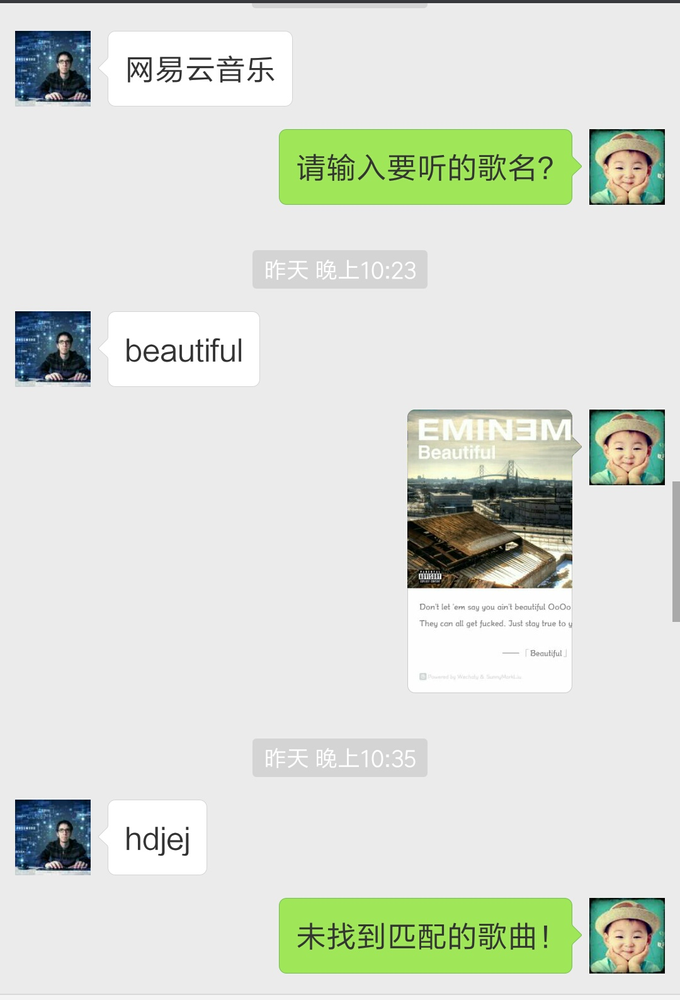

# NeteaseCloudMusicBot

NeteaseCloudMusicBot is a wechat bot built on [Wechaty](https://github.com/chatie/wechaty).  
The song's name you send to the bot, a beautiful picture which contains song's lyric and cover you will get. That's it! 

## Result

  

## How To Use

1. Download [STHeiti-Light.ttc](http://vdisk.weibo.com/s/umRnjgAYnq1Sl) and put it in `res` directory.
2. Run `npm install` to install dependencies.
3. Run `node bot.ts` to fire the bot.

## References

- [https://github.com/chatie/wechaty](https://github.com/chatie/wechaty)
- [https://github.com/yanunon/NeteaseCloudMusic](https://github.com/yanunon/NeteaseCloudMusic)
- [https://github.com/Urinx/NeteaseLyric]()

## License

This project is licensed under the terms of the MIT license.
